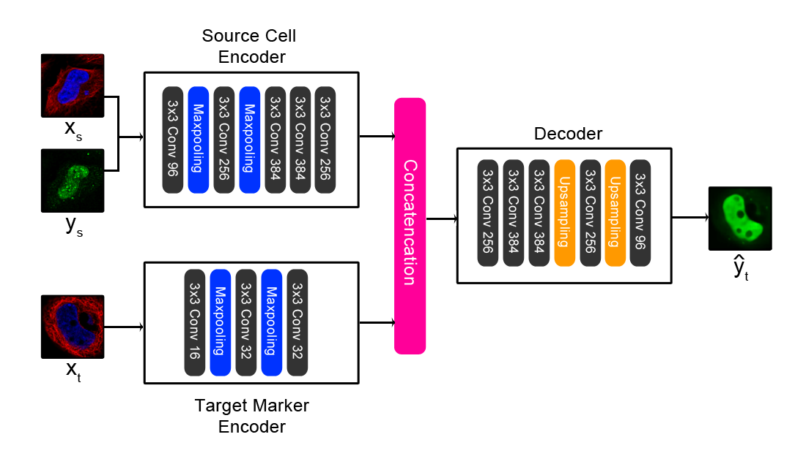

# Paired Cell Inpainting

Paired cell inpainting is a self-supervised learning training task designed to learn features representations for single cell microscopy images with multiple channels, completely unsupervised.  Our approach leverages the typical structure of these images to define the pretext training task: in many cases, each image contains multiple genetically identical cells, growing under the same experimental condition, and these cells exhibit similar patterns of protein expression. The cells are imaged in multiple “channels” (such as multiple fluorescence colours) that contain very different information. By exploiting this structure, we define a pretext task that relies only upon image content, with no prior human labels or annotations incorporated. In our examples, one set of channels represents one or more structures in the cell (e.g. the cytosol, nucleus, or cytoskeleton), and another channel represents proteins of interest that have been fluorescently tagged to visualize their localization (with a different protein tagged in each image). Then, given both channels for one cell and the structural markers for a different cell from the same image, our CNN is trained to predict the appearance of the protein of interest in the second cell.

This repository implements the architecture shown above. 

For full details, see our BioRxiv pre-print:
https://www.biorxiv.org/content/early/2018/11/20/395954

# Important Note:

To achieve the results reported in our manuscript, the model requires a large amount of training data. We have included pretrained weights for both of the models we used to extract features for our manuscript. As our training datasets are large (>200 GB), it was not possible to include the full data for reproducing these weights. For the yeast model, we have included a small toy dataset of 5 proteins, but models trained on this data will not achieve results comparable to our pretrained model and should only be used to verify our training code's functionality. For the human model, included a small toy dataset of 3 proteins, and we have also included scripts to systematically download and crop the training data, as this data is more readily available to the public.

# System Requirements:
Operating system:
This code was tested on a CentOS Linux 7 server

Our code requires and has been tested with Python 3.6.1, with the following packages:
cudatoolkit 9.0
cudnn 7.1.2
deepdish 0.3.4
keras 2.1.5
h5py 2.7.0
mahotas 1.4.4
numpy 1.13.3
pandas 0.22.3
Pillow 5.1.0
skikit-image 0.13.1
scikit-learn 0.19.0
scipy 1.1.0
tensorboard 1.7.0
tensorflow 1.3.0
tensorflow-gpu 1.7.0

Hardware requirements:
- For training our neural networks, we used a Tesla K40c GPU. 
- During training, image preprocessing is parallelized on the CPU. We used 40 Intel Xeon Processor E7-8870 v4 CPU cores. 
- For the human model, we recommend at least 250 GB of available hard drive space, if you choose to download the full dataset. 

# Yeast Model
We have provided a small toy dataset for the yeast model for demo purposes. Full reproduction of the results reported in our manuscript requiresdownloading of the entire yeast and human datasets we used; we have included instructions and estimated running times in the "Instructions for Use" section. 

To run our code on the small toy dataset:

## Training
1. Change directories to the yeast_model directory
1. Open the "opts.py" file and change the "checkpoint_path" variable to the directory to save the weights of the trained model in. By default, this argument is set to the pretrained weights, so change this or else these weights will be overwritten by your training run. Learning rate and number of epochs can also be specified under opts. 
(Note that the number of channels in the source image and the target marker image are hardcoded under train.py when declaring the Pair_Model() object, as 2 and 1, respectively. If there are different numbers of channels in your images, you may need to change these.)
3. Run the training script by issuing command line argument "python train.py". This will train the model and save the weights in the checkpoint_path directory as "model_weights.h5"
The training script will run for 30 epochs; with the toy dataset provided, this should take ~20 minutes with the hardware specs above (note that this will be much slower without a GPU)

## Extracting Features:
1. Change directories to the yeast_model directory
2. Open the "opts.py" file and change the "checkpoint_path" variable to the directory to find pretrained weights from. We have provided pretrained weights used in the manuscript, so to use these, set the variable to "./pretrained_weights/" 
(The dataset to extract features from can also be changed in opts.py by changing the "data_path" argument; by default, this is set to the toy dataset)
3. Run the evaluation script by issuing command line argument "python eval_layer.py". This will extract features from single cells in the toy dataset. Output files will be saved in the
directory given by the "checkpoint_path" variable; these files will contain all features for all of the single cells at each of the 5 convolutional layers as a tab-delimited file. 
Each cell is saved as a row in this text file, and each column is a feature (with the first column being the file name of the single cell crop). 5 files will be saved, with suffixes
"conv1_1" to "conv5_1", which are in order, features extracted from each convolutional layer in the CNN respectively (we had best results using conv3_1 and conv4_1). With the toy
dataset provided, this step should take less than 5 minutes with the hardware specs above. 

## Benchmarking
1. Labeled data that we used for the benchmark can be downloaded from this link: http://spidey.ccbr.utoronto.ca/~okraus/DeepLoc_full_datasets.zip
2. To unpackage the archives provided in this zip file, "unpackage_test_set.py" in the preprocessing subfolder of the yeast_model folder by issuing command "python unpackage_test_set.py"
(Note that you may need to change the "path" and "allpaths" variable to point to where the Chong archives are saved in your server)
3. This script will save the files in /yeast_model/test_set/ by default; images will be stored in /yeast_model/test_set/images/, and pre-extracted CellProfiler features will be saved as a 
text file (for benchmark purposes, these features aren't used by our code). 
4. Finally, the features can be extracted for the Chong dataset as detailed above in "Extracting Features". Note that in our benchmarks, we merged the "Spindle" and "Spindle Pole" classes.

# Human Model
To reproduce the results comparable to those presented in the manuscript (both in terms of training the model and in extracting features), the full datasets used are required. For your convenience, for the human model, we provide scripts to automatically download and preprocess all of the images from the Human Protein Atlas. 

NOTE:
All steps will assume the user is in the "human_model" directory

## Downloading the Full Images:
1. To download images from the Human Protein Atlas, we have included a python script under /data_download/download_hpa.py To run, call "python download_hpa.py".
2. Depending on your internet connection, this step will take about a week. (Note that this step will download about 24 GB of data)
3. This script will save images in the "human_protein_atlas" directory under the "human_model" directory by default. 

## Segmenting the Full Images into Single-Cell Crops:
1. To convert the raw images into a format appropriate for training and feature extraction, we extract crops around the single cells in these images. This is done by using the nuclear channel, as the nuclei are well separated and easy to segment using standard computer vision techniques (an otsu filter) in this dataset. 
2. We have included a python script under /data_download/segment_and_crop_human_atlas.py To run, call "python segment_and_crop_human_atlas.py".
3. This script will save images in the "human_protein_atlas_single_cell" directory under the "human_model" directory by default. This step should take 1-2 days, and will save about 200 GB of data. By default, the script will downsample the images to 25% of the original size, and segment 128x128 crops of single cells. We further reduce these crops to 64x64 during training, to reduce training time (it is possible to use larger resolution crops during training, but we need to optimize the model architecture to accommodate this change in resolution - this is left for future work.) 

## Filtering the Data:
1. We remove any images with fewer than 5 single cell crops, to ensure all data has enough crops. 
3. To remove cells with too few proteins, we have included a script under /preprocessing/filter_dataset_by_number.py. To run, call "python filter_dataset_by_number.py". This will remove any directories in the human_protein_atlas_single_cell directory with fewer than 5 cells. 

## Training:
1. Open the "opts.py" file and change the "checkpoint_path" variable to the directory to save the weights of the trained model in. By default, this argument is set to the pretrained weights, so changethis or else these weights will be overwritten by your training run.  Learning rate and number of epochs can also be specified under opts. 
(Note that the number of channels in the source image and the target marker image are hardcoded under train.py when declaring the Pair_Model() object, as 2 and 1, respectively. If there are different numbers of channels in your images, you may need to change these.)
2. Run the training script by issuing command line argument "python train.py". This will train the model and save the weights in the checkpoint_path directory as "model_weights.h5"
The training script will run for 30 epochs; this will take about 3-4 days with the hardware specs we used (training this model without a GPU is very computationally expensive and likely unfeasible.)

## Extracting Features:
1. Open the "opts.py" file and change the "checkpoint_path" variable to the directory to find pretrained weights from. We have provided pretrained weights used in the manuscript, so to use these, set the variable to "./pretrained_weights/"; alternatively, you can use your own weights from the previous training step. We have also included an alternative weights file in /pretrained_weights/filtered_model_weights.h5. These are trained weights with variable proteins filtered from the Human Protein Atlas, and extract better representations than the weights we trained using all of the Human Protein Atlas, noise included. To toggle to this file, change the final line in train.py.
2. Run the evaluation script by issuing command line argument "python eval_layer_all_cells.py". This will extract features from single cells in the "human_protein_atlas_single_cell" directory (note that you will need to download these images first, as in the "Downloading the Raw Images" and "Segmenting the Raw Images" step; the directory of images to extract features from can be changed by changing the 
"datapath" variable. By default, the script is configured to extract features from the 3rd convolutional layer of our network, but this can be changed by changing the "target_layer" variable in the script. 
3. This script will save all features inside the checkpoint_path directory, in a "features" subdirectory. A separate text file will be saved for each image, containing all of the single cells features for that image. This step will take approximately 1 hour, depending on which layer you extract features from and how much data you have, and does not require a GPU. 

